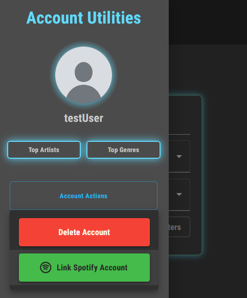
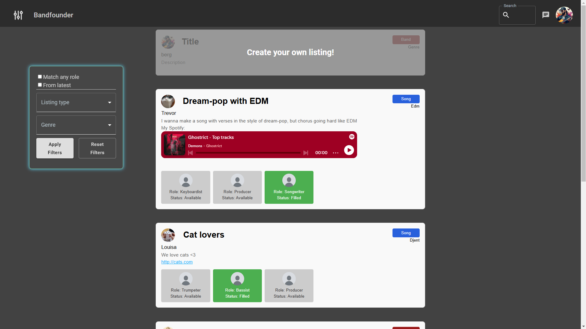
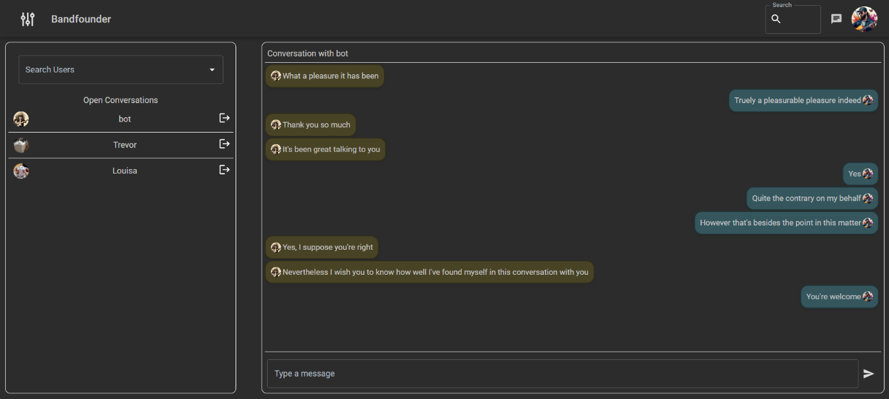
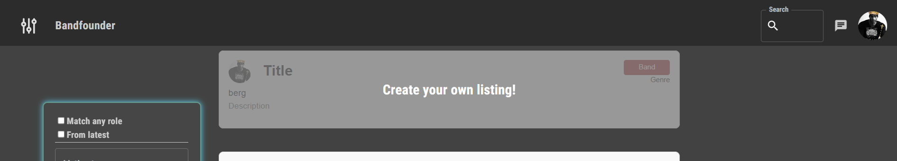
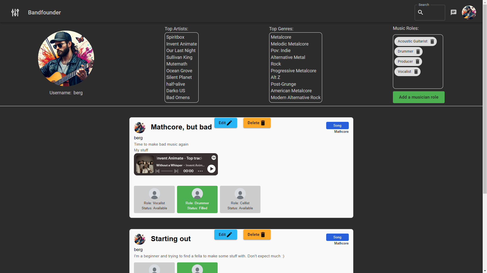

# BandFounder

BandFounder is a web application that connects musicians through their skills and musical taste, helping you find the perfect bandmates or collaborators for your next song.

## What can you do?

### Create an account and set up your profile

- Register your account
- Add your the musician roles you'd be interested in performing
- Upload a profile picture
- Connect your Spotify account to analyze your music taste (in the lop-left menu)
  
- Alternatively you may also add artists manually

### Browse open listings on the main page

Once you find a listing you're interested in, you can click on the authors icon to contact them directly and talk
through the details of the collaboration

### Chat with other musicians

### Music Integration

Based on the artists you listen to on Spotify or added manually, Bandfounder will be able to compare your music taste
with that of other users.

### Create your own listings
At the top of the main page you'll find the widget to open a form for a listing

### Edit or delete listings
On your profile's page you'll find all your listings with the ability to edit or remove any of them.
